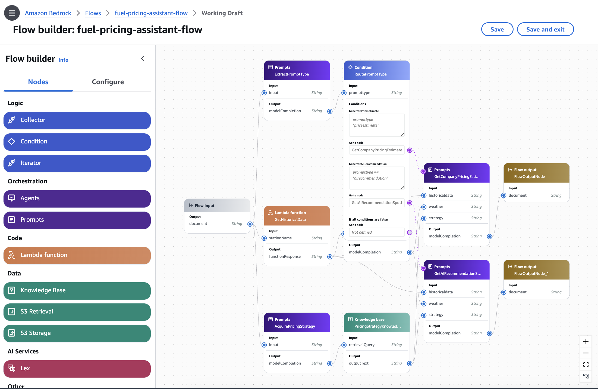
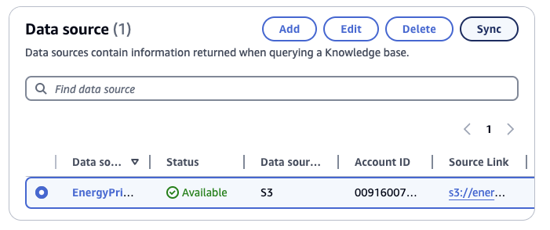
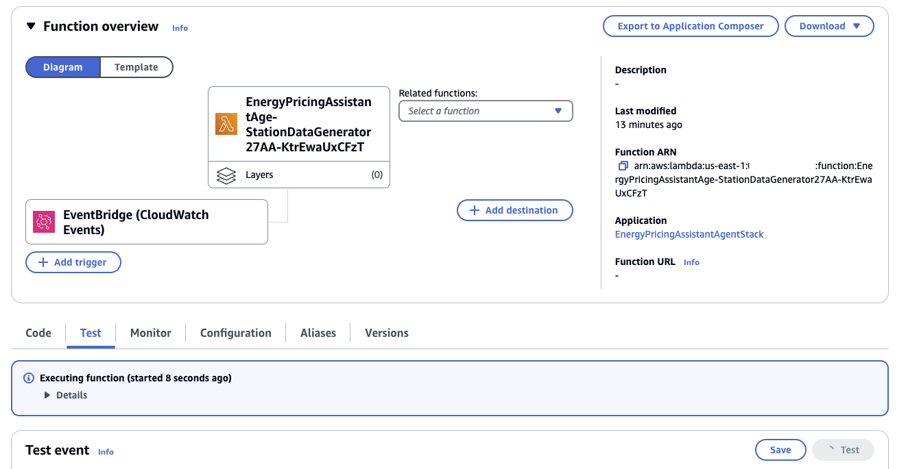

# Energy Pricing Assistant

- [Energy Pricing Assistant](#energy-pricing-assistant)
  - [Overview](#overview)
    - [1. Bedrock Flows](#1-bedrock-flows)
    - [2. RAG Knowledge Base](#2-rag-knowledge-base)
    - [3. Runtime Chatbot](#3-runtime-chatbot)
  - [End-to-end Architecture](#end-to-end-architecture)
  - [Demo Script](#demo-script)
  - [Setup](#setup)
    - [Pre-requisites](#pre-requisites)
    - [Run CDK](#run-cdk)
    - [Trigger the data simulation](#trigger-the-data-simulation)
    - [Cleanup](#cleanup)


## Overview
This demonstration showcases an AI assistant designed for gas station pricing analysts. The assistant can gather and analyze data from diverse sources, such as weather patterns, traffic conditions, historical pricing strategies, and competitor actions.  By leveraging this information, analysts can significantly accelerate the process of estimating pricing updates and uncover valuable insights that may inform decision-making.

### 1. Bedrock Flows

Near realtime data sources are queried on demand through Bedrock Flows. Bedrock Flows enables analysts to ask for fuel price estimates using several data sources from dynamodb or potentially other sources or vendor APIs like weather and traffic. With context gathered through this flow, a prompt is constructed for Amazon Nova Lite v1 via Bedrock to provide a fuel price estimate and supporting evidence. Anthropic Claude Haiku v3 is also utilized in generating a response to results retrieved from the Bedrock Knowledge Base.




### 2. RAG Knowledge Base

The RAG knowledge base leverages the Knowledge Bases for [Amazon Bedrock](https://aws.amazon.com/bedrock/knowledge-bases/) and its [metadata filter feature](https://aws.amazon.com/blogs/machine-learning/knowledge-bases-for-amazon-bedrock-now-supports-metadata-filtering-to-improve-retrieval-accuracy/), allowing for more granular search on pricing data based on metadata like **location** and other relevant attributes. This knowledge base stores and organizes the ingested strategy data in a way that supports efficient retrieval and generation of information based on the RAG model, while enabling users to slice and dice the data according to their specific needs.

### 3. Runtime Chatbot

The runtime chatbot is a React-based website that uses a WebSocket API and a Lambda function architecture. The conversation history is stored in DynamoDB. The Lambda function uses the Amazon Bedrock Converse API to reason and retrieve relevant documents from the knowledge base, providing the final answer to users in training scenarios for fuel pricing analysts.


## End-to-end Architecture


## Demo Script

The demo script, use case, and persona is provided here: [Demo Script](/docs/demoscript/Analyst_Demoscript.md)


## Setup

### Pre-requisites
1. The solution is only available in `us-east-1`. Please choose either of them to proceed.
2. [Enable models in Amazon Bedrock](https://docs.aws.amazon.com/bedrock/latest/userguide/model-access.html): for this use case, you need to enable Amazon Nova Lite v1, Anthropic Claude Haiku v3 and Titan Embeddings models 
3. [Get started with CDK](https://docs.aws.amazon.com/cdk/v2/guide/getting_started.html).
4. [Install Docker](https://www.docker.com/get-started/). Because we are bundling Lambda functions when running CDK so we need to install Docker. Please see the blog post about [Building, bundling and deploying applications with the AWS CDK](https://aws.amazon.com/blogs/devops/building-apps-with-aws-cdk/)


### Run CDK
1. Clone this repository.
2. Export `AWS_DEFAULT_REGION` to us-east-1 region following the [CDK cli guide](https://docs.aws.amazon.com/cdk/v2/guide/cli.html#cli-environment).
   ```
   export AWS_DEFAULT_REGION=us-east-1
   ```
3. Install npm modules
   ```
   cd cdk-stacks
   npm install
   ``` 
4. CDK bootstrap 
   ```
   cdk bootstrap
   ```
5. At this point you can now synthesize the CloudFormation template for this code.
    ```
    aws ecr-public get-login-password --region us-east-1 | docker login --username AWS --password-stdin public.ecr.aws
    cdk synth
    ```
6. Deploy the application
    ```
    cdk deploy --all --require-approval never --parameters EnergyPricingAssistantAgentStack
    ```
### Trigger the data simulation
1. Sync Bedrock Knowledgebase
   
   a. Open [AWS Bedrock console](https://console.aws.amazon.com/bedrock). **Knowledge base** -> `EnergyPricingAssistant`. 

   b. Click **sync**
   

2. Trigger the data simulation for initial use:
   
   a. Open [AWS Lambda console](https://console.aws.amazon.com/lambda). Find the Lambda function that looks like this `EnergyPricingAssistantAge-StationDataGenerator27AA-KtrEwaUxCFzT`

   b. Click on **Test** to trigger the data generation. This takes 3-5 minutes. You will need to do this twice
   


### Cleanup
Run the following commands to destroy all Stacks. 
```
cdk destroy --all
```
Enter `y` upon the prompt to destroy each Stack. 

## Security

See [CONTRIBUTING](CONTRIBUTING.md#security-issue-notifications) for more information.

## License

This project is licensed under the Apache-2.0 License.

