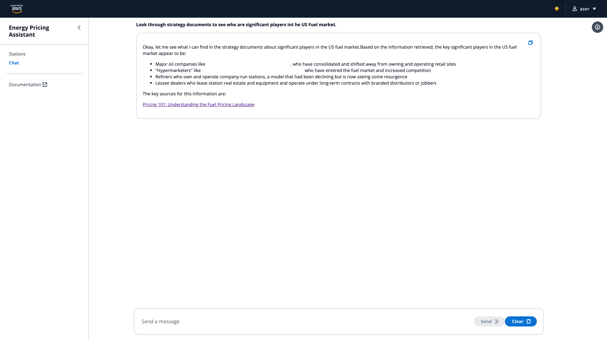
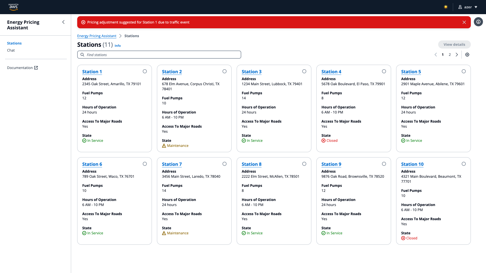
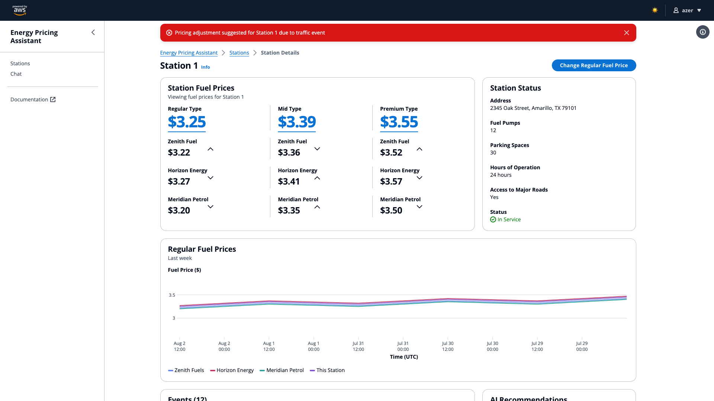
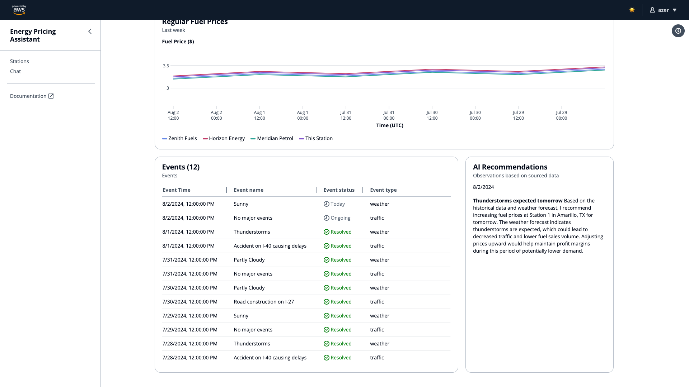
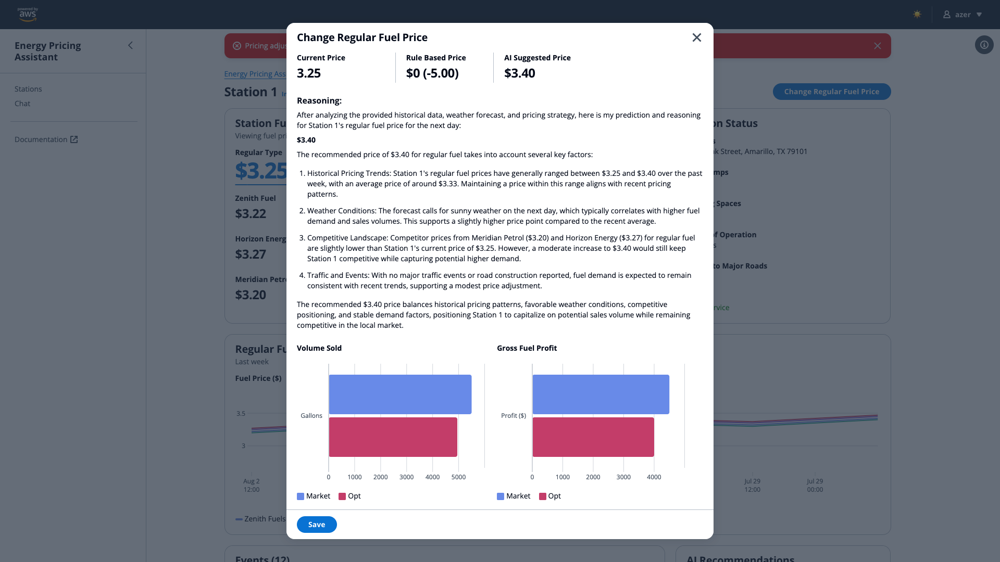

# Analyst - Pricing Estimate Demo Script

## Persona - Analyst

Fuel Pricing Analysts are the data-driven decision-makers in the oil and gas industry. They analyze markets, monitor competitors, and develop pricing strategies that maximize profit. By leveraging their analytical skills and technological expertise, they identify opportunities to boost margins and mitigate risks, directly impacting company earnings and consumer prices.

## Use Case Scenario

**Pricing Estimates:** Pricing for Regular, Mid, and Premium pricing is extremely competitive. To select optimal prices, an extensive amount of time and effort is required to analyze various data sources.

**Problem:** Analyst need support analyzing several sources of data including weather, traffic, competitor prices, and pricing strategies that may be region specific. 

**Analyst:** The analyst, Jackie, is relatively new. While she has received basic training, she needs support identifying patterns in the data that would indicate a leading or lagging strategy as well as situational awareness to recent events.

### AWS-Enabled Solution:

**Training Support:** An AI chatbot that is indexed on company fuel pricing strategies provides support to analysts in identifying regional laws and guidance. Analysts can ask questions to quickly find information

**AI Recommendations Spotlight:** Daily spotlights are generated based on current data including weather and traffic events and competitor data. Guidance is provided for a specific station if prices should be adjusted.

**AI Pricing Estimate:** When an Analyst is looking to adjust fuel prices for a specific station, relevant data is obtained from several data sources including pricing strategies the make an informed estimate on a fuel price with supporting evidence.

### Benefits:

**Faster Problem Resolution:** The AWS solution empowers a less-experienced analyst to act quickly and decisively, leading to increased revenue

**Knowledge Capture:** The system helps the company capture and codify pricing knowledge, reducing reliance on experienced veterans in the long run.

**Upskilling:** Over time, the system helps analysts like Jackie build their knowledge and confidence, improving employee retention.

## Demo Script

This demo script takes a Jackie, an Analyst, through multiple interactions with an AI Assistant. Both a chat bot and Dashboard interacts with AI on demand or in the generations of AI Recommendations based on current events.

Chat with Generative AI and ask questions towards Pricing Strategy documents.

Click on Stations to view a list of all Stations managed by Jackie.

View current (synthetic) pricing data, historical trends, and competitor price data.

Scroll down to see AI Recommendations in the spotlight widget to see suggestions based on various data sources and forecasts.

With the suggestion to consider adjusting prices, click on `Change Regular Fuel Price`. After ~10 seconds, a pricing estimate will be provided with a brief description for the rational behind that price.

